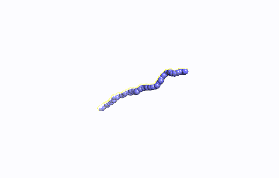
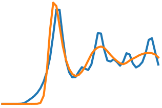

# torchmd

PyTorch code for End-to-end differetiable molecular simulations. Complete code and demo coming soon.

Paper: 

Wang, W., Axelrod, S., & Gómez-Bombarelli, R. (2020). Differentiable Molecular Simulations for Control and Learning. ArXiv. Retrieved from https://arxiv.org/abs/2003.00868

### Applications

#### Controllable Fold for polymer chain 
Folding a polymer with Graph Neural Networks 

  

#### End-to-End Fitting for Macroscopic Observable 
Backpropagating through the trajectory to train a GNN that reproduces a target pair distribution function  

  

#### Quantum Isomerization 

We fit electric field to optimize efficiency of a quantum isomerization process 

