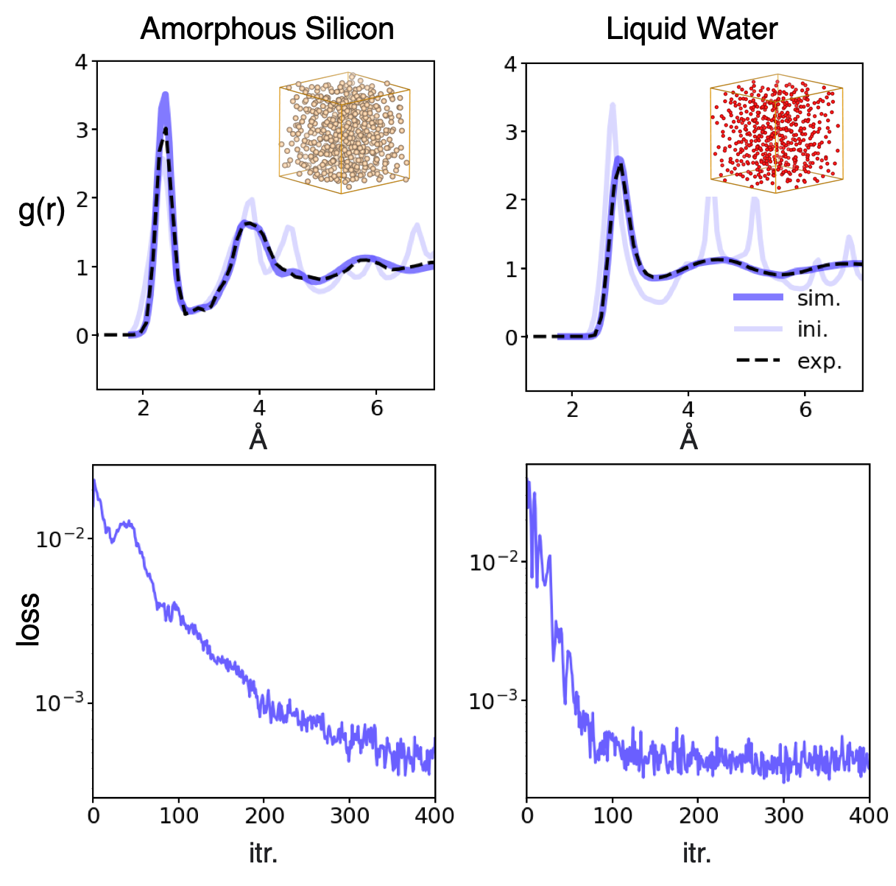
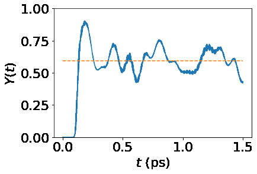

# torchmd
<p align="left">
  
</p> 

<p align="left">
  
</p>

This is not just a regular simulator but a DIFFERENTIABLE simulator!

PyTorch code for End-to-end differetiable molecular simulations. More docs and tutorials are comings.
This repo is under heavy development, your contribution is very much welcomed.  


<p align="center">
  
</p>


### Install packages 

I highly recommend creating a dedicated conda environment via: 
```
conda create -n mdgrad python=3.8
```

Download and install 
```
git clone https://github.com/torchmd/mdgrad.git
cd mdgrad
conda activate mdgrad
pip install -r requirements.txt # I have tested this, it should work 
pip install -e . # -e is useful if you want to edit the source code
```


## Highlights

- Reverse-mode automatic differentiation through ODE Solver (O(1) backprop)
- solvers supported: 4th order Runge-Kutta and Velocity Verlet 
- Include a Graph Neural Network Module (our own SchNet implementation)
- GPU-accelerated Neighborlist algorithm
- End-to-End Differentiable Observable implemented - RDF, VACF
- Good for single molecule and condensed phase( liquids and solids )
- Compatible with ASE for system initialization 
- Users can write interface to their favorite Force Field architecture (SchNet, DimeNet, SE3NN, LAMMPS etc.)

Wang, W., Axelrod, S., & Gómez-Bombarelli, R. (2020). Differentiable Molecular Simulations for Control and Learning. https://arxiv.org/abs/2003.00868

<p align="center">
  
</p>

This repo features the following [demos](https://github.com/wwang2/torchmd/tree/master/demo):

1. Differentiable folding of a polymer 

2. Learning interactions from observables (pair correlation function, velocity auto-correlations)

3. Quantum isomerization of a minimal retinal model 

```
# Define a box of particles 
L = 1.6 
atoms = FaceCenteredCubic(symbol='H', size=(3, 3, 3), latticeconstant=L, pbc=True)

# use System to wrap ase.atoms
from torchmd.system import System 
device = 'cuda:0'
system = System(atoms, device=device)
system.set_temperature(1.0)

# Define interactions 
from torchmd.potentials import ExcludedVolume
pair = PairPotentials(system, ExcludedVolume, **{'epsilon': 1.0,  'sigma': 1.0,"power": 12}, cutoff=2.5).to(device)

# Define simulation
from torchmd.md import NoseHooverChain
integrator = NoseHooverChain(model, 
            system,
            Q=50.0, 
            T=1.0,
            num_chains=5, 
            adjoint=True).to(device)

sim = Simulations(system, integrator)

# Simulate 
v_t, q_t, pv_t = sim.simulate(steps=50, frequency=50, dt=0.01) #v_t: velocity  q_t: position  pv_t bath: variables

# Compute observable 
obs = rdf(system, nbins=100, r_range=(0.75, 2.5))
_, _, g = obs(q_t)

g.sum().backward()
# You will find out g can be backpropagated for gradient cumulation, give it a try!
```

### DEMOs

#### End-to-End Fitting for Macroscopic/Coarse-Grained Observable 
Backpropagating through the trajectory to train a GNN that reproduces a target pair distribution function.
We demonstrated the fitting of water rdf (Oxygen-Oxygen) at 298k with differentiable simulations
<p align="center">
  
</p>


#### Controllable Fold for polymer chain 
Folding a polymer with Graph Neural Networks 

<p align="center">
  
</p>


#### Quantum Isomerization 

We fit electric field to optimize efficiency of a quantum isomerization process for retinal molecule

<p align="center">
  
</p>

### TODO 

- Imeplement Forward Sensitivity solver
- More thermostats (Parrinello-Rahman dynamics, etc.) 
- Interface to LAMMPS so that this tool can be used as a plug-in for LAMMPS simulations 
- Write interface to SE3NN, DimeNET, etc.
- Better loggers for observables
