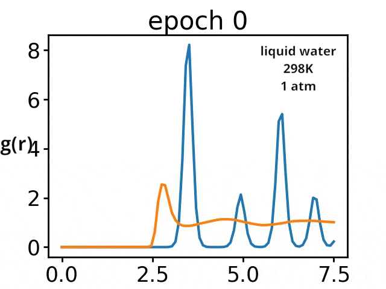

# torchmd

  

 

PyTorch code for End-to-end differetiable molecular simulations. Complete code and demo coming soon.

Paper: 

Wang, W., Axelrod, S., & Gómez-Bombarelli, R. (2020). Differentiable Molecular Simulations for Control and Learning. ArXiv. Retrieved from https://arxiv.org/abs/2003.00868

  

### Applications

#### End-to-End Fitting for Macroscopic/Coarse-Grained Observable 
Backpropagating through the trajectory to train a GNN that reproduces a target pair distribution function.
We demonstrated the fitting of water rdf (Oxygen-Oxygen) at 298k with differentiable simulations

  

#### Controllable Fold for polymer chain 
Folding a polymer with Graph Neural Networks 

  

#### Quantum Isomerization 

We fit electric field to optimize efficiency of a quantum isomerization process [Coming]

